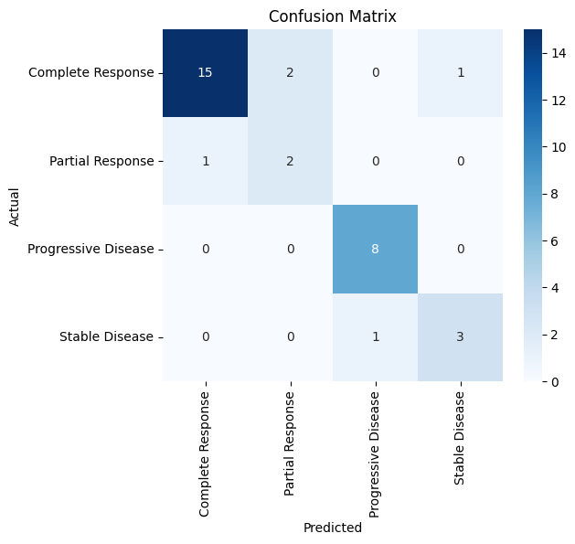
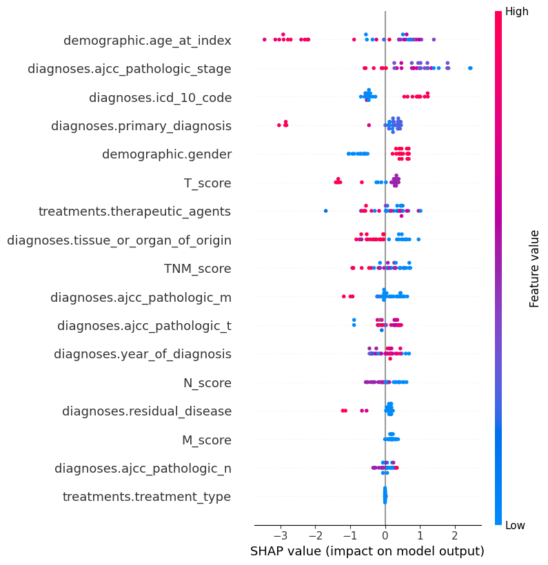

# Lung Cancer Treatment Outcome Prediction using Machine Learning

## Overview

This project develops a **machine learning pipeline to predict chemotherapy treatment outcomes in lung adenocarcinoma patients** using clinical data from The Cancer Genome Atlas (TCGA).

The model integrates **clinical staging features, feature engineering, class imbalance correction, and hierarchical machine learning** to predict four treatment outcomes:

* Complete Response
* Partial Response
* Stable Disease
* Progressive Disease

The goal is to demonstrate how **machine learning can assist clinical decision-making by predicting patient treatment responses based on tumor characteristics and demographic factors.**

---

# Dataset

The dataset contains **164 patient samples with 14 clinical variables** including:

### Demographic Features

* Age at diagnosis
* Gender

### Tumor Characteristics

* AJCC pathological stage
* Tumor size (T)
* Lymph node involvement (N)
* Metastasis (M)
* Residual disease status
* Tissue/organ of origin
* Primary diagnosis

### Treatment Information

* Therapeutic agents
* Treatment type

### Target Variable

`treatments.treatment_outcome`

Classes:

| Outcome             | Description           |
| ------------------- | --------------------- |
| Complete Response   | Tumor disappearance   |
| Partial Response    | Tumor reduction       |
| Stable Disease      | No significant change |
| Progressive Disease | Tumor progression     |

---

# Methodology

The pipeline includes several steps commonly used in **clinical machine learning studies**.

## 1. Feature Engineering

Clinical TNM staging information was converted into numeric features:

```
T_score = Tumor size
N_score = Lymph node involvement
M_score = Metastasis
TNM_score = T + N + M
```

This helps the model better capture disease severity.

---

## 2. Handling Class Imbalance

The dataset is highly imbalanced.

To address this, **SMOTENC (Synthetic Minority Oversampling Technique for Categorical Data)** was used to generate synthetic samples for underrepresented classes.

---

## 3. Hierarchical Classification

Instead of directly predicting four classes, the model uses a **two-stage hierarchical prediction strategy**.

### Stage 1

Predict whether the patient is a:

* Responder
* Non-Responder

### Stage 2

If Responder:

* Complete Response vs Partial Response

If Non-Responder:

* Stable Disease vs Progressive Disease

This strategy improves prediction accuracy for small datasets.

---

## 4. Machine Learning Model

The model used is **CatBoost**, which is particularly effective for datasets with many categorical features.

Model advantages:

* Handles categorical variables efficiently
* Robust to overfitting
* Performs well on small clinical datasets

---

# Model Performance

Final evaluation was performed on an independent **20% test dataset**.

| Metric            | Score    |
| ----------------- | -------- |
| Accuracy          | **0.85** |
| ROC-AUC           | **0.88** |
| Weighted F1-score | **0.85** |

---

# Confusion Matrix



Key observations:

* Progressive Disease predicted perfectly (8/8)
* Stable Disease predicted accurately (3/4)
* Complete Response predicted well (15/18)

Partial Response remains difficult due to limited samples.

---

# Explainable AI (SHAP)

To interpret model predictions, **SHAP (SHapley Additive Explanations)** was used.



Most influential predictors:

* Age at diagnosis
* AJCC pathological stage
* Tumor size (T score)
* Lymph node involvement (N score)
* Residual disease

These findings are consistent with established **oncology research on treatment response predictors.**

---

# Technologies Used

### Programming

* Python

### Machine Learning

* CatBoost
* Scikit-learn
* SMOTENC (Imbalanced-learn)

### Data Analysis

* Pandas
* NumPy

### Visualization

* Matplotlib
* Seaborn
* SHAP

---

# Repository Structure

```
Lung_Cancer_Treatment_Outcome_Prediction

│
├── data
│   └── xp.xlsx
│
├── notebooks
│   └── lung_cancer_model.ipynb
│
├── images
│   ├── confusion_matrix.png
│   └── shap_summary.png
└── README.md
```

---

# Results Interpretation

The model demonstrates that **clinical staging variables and patient age are strong predictors of chemotherapy response**.

Patients with:

* higher AJCC stage
* larger tumor size
* lymph node involvement

are more likely to experience **progressive disease**.

This highlights the potential of **machine learning in personalized cancer treatment planning.**

---

# Future Work

Potential improvements include:

* Integration of genomic and transcriptomic data
* Survival analysis using Cox models
* Graph neural networks for drug response prediction
* Larger multi-cohort datasets

---

# Author

**Tirth Patel**
Bioinformatics Student – Marwadi University

* GitHub: https://github.com/tirth1305
* LinkedIn: https://linkedin.com/in/tirthpatel1305

---

# License

This project is intended for **academic and research purposes**.

